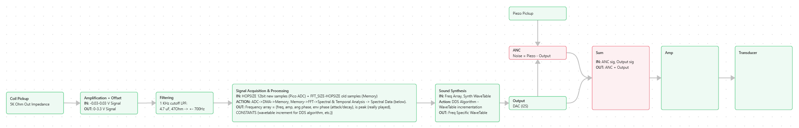
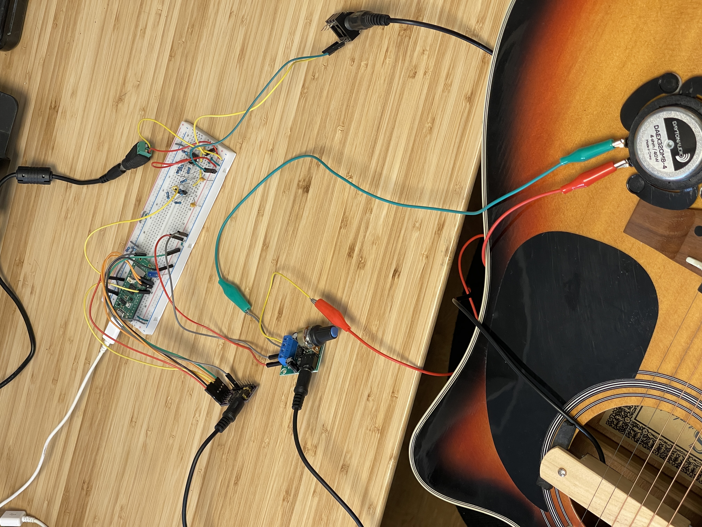

# acoustic-synth
# Real-Time Electro-Acoustic Synthesizer
## Overview
Acousynth Live is a closed-loop embedded system designed to create self-sustaining acoustic textures. Unlike a traditional synthesizertimer, this system captures the physical vibrations of a string instrument (via Coil pickup), analyzes the spectral content in real-time, and generates a corresponding additive synthesis signal to drive the instrument's body back into resonance.
This performed by a low-latency signal chains on a Raspberry Pi Pico, combines analog acoustics and digital signal processing.

**Signal Flow Diagram** 
*note that the ANC feature hasn't been implemented yet.

**Prototype**

* **Zero-Copy Latency:** Utilizes RP2040 DMA (Direct Memory Access) to move audio data between ADC, RAM, and I2S interfaces without CPU intervention.
* **Spectral Analysis:** Implements a Windowed FFT to track fundamental frequencies .
* **Additive Synthesis:** Based on the analysis, re-generates notes played using a custom 32-bit Direct Digital Synthesis (DDS) engine with dynamic harmonic mixing.

---

## Preview Video
To be updated.

---

## Hardware Implementation

### Analog Front End
To interface the coil sensors with the RP2040's 12-bit ADC, I designed a custom pre-amplifier circuit.

*Pre-Amp Stage Circuit Sketch, output goes to a standart RC LPF Circuit for Anti-Aliasing filtering.* 
Components:
- TL072 Op-Amp
- Coil Pickup

### Output Chain
I2S DAC to a transducer speaker   
Components:
- PCM5102A I2S DAC
- LM386 10W Audio Amp
- Dayton Audio DAEX32QMB-4 Quad Feet Mega Bass 32mm Exciter 40W 4 Ohm

---

## Software & Firmware Design

### A. Data Acquisition
* **Double Buffering:** Implemented a "Ping-Pong" buffer scheme. While the DMA fills `Buffer_A`, the CPU processes `Buffer_B`.
* **Interrupt Handling:** A minimal ISR handles the pointer swapping to ensure continuous sampling at **44.1kHz** (Output) and **~3kHz** (Input, optimized for frequency tracking resolution).

### B. Signal Processing
* **FFT Implementation:** Utilized the `KissFFT` fixed-point library.
* **Hanning Window:** Applied a pre-calculated window function to the input buffer to minimize spectral leakage.
* **Peak Detection:** Custom algorithm to identify local maxima and calculate "Stability Scores" to reject transient noise (fret buzz, knocks).

### C. Synthesis Engine
* **DDS (Direct Digital Synthesis):** Uses 32-bit phase accumulators for high-precision pitch generation.
* **Look-up Tables:** Statically allocated sine, saw, and square waves in RAM to avoid expensive trig calculations in the interrupt loop.
* **Mixing:** 4-channel additive mixer with soft-clipping protection.
