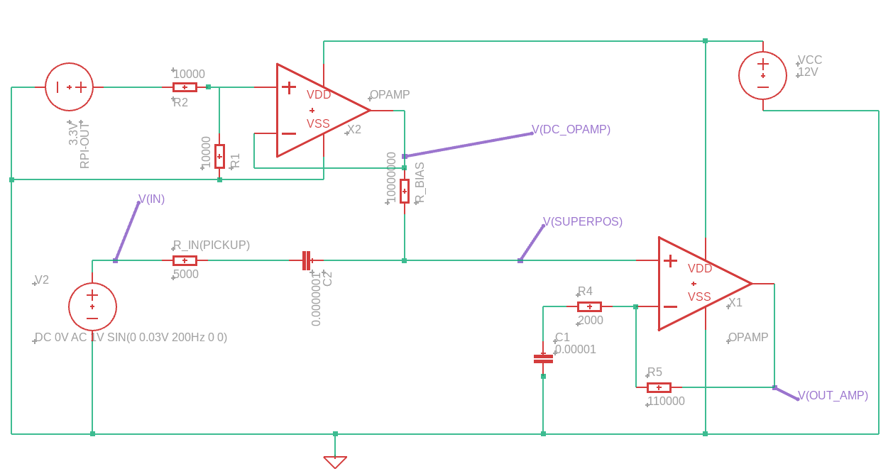

# acoustic-synth
# Acousynth Live: Real-Time Electro-Acoustic Synthesizer

**Platform:** Raspberry Pi Pico (RP2040) | **Language:** C++
## Overview
Acousynth Live is a closed-loop embedded system designed to create self-sustaining acoustic textures. Unlike a traditional synthesizer that runs on a timer, this system listens to the physical vibrations of a string instrument (via Piezo pickups), analyzes the spectral content in real-time, and generates a corresponding additive synthesis signal to drive the instrument's body back into resonance.

The project demonstrates the implementation of **deterministic, low-latency signal chains** on a dual-core microcontroller, bridging the gap between analog acoustics and digital signal processing.

### Capabilities
* **Zero-Copy Latency:** Utilizes RP2040 DMA (Direct Memory Access) to move audio data between ADC, RAM, and I2S interfaces without CPU intervention.
* **Spectral Analysis:** Implements a Windowed FFT to track fundamental frequencies .
* **Additive Synthesis:** Based on the analysis, re-generates notes played using a custom 32-bit Direct Digital Synthesis (DDS) engine with dynamic harmonic mixing.

---

## System Architecture
The system follows a strict "Producer-Consumer" pipeline to ensure thread safety and timing stability.

---

## Hardware Implementation

### Analog Front End (AFE)
To interface the coil sensors with the RP2040's 12-bit ADC, I designed a custom pre-amplifier circuit.

*Pre-Amp Stage Circuit Sketch, output goes to a standart RC LPF Circuit for Anti-Aliasing filtering.*

---

## Software & Firmware Design

### A. Data Acquisition (DAQ)
* **Double Buffering:** Implemented a "Ping-Pong" buffer scheme. While the DMA fills `Buffer_A`, the CPU processes `Buffer_B`.
* **Interrupt Handling:** A minimal ISR handles the pointer swapping to ensure continuous sampling at **44.1kHz** (Output) and **~3kHz** (Input, optimized for frequency tracking resolution).

### B. Signal Processing (DSP)
* **FFT Implementation:** Utilized the `KissFFT` fixed-point library.
* **Hanning Window:** Applied a pre-calculated window function to the input buffer to minimize spectral leakage.
* **Peak Detection:** Custom algorithm to identify local maxima and calculate "Stability Scores" to reject transient noise (fret buzz, knocks).

### C. Synthesis Engine
* **DDS (Direct Digital Synthesis):** Uses 32-bit phase accumulators for high-precision pitch generation.
* **Look-up Tables:** Statically allocated sine, saw, and square waves in RAM to avoid expensive trig calculations in the interrupt loop.
* **Mixing:** 4-channel additive mixer with soft-clipping protection.

---

## Build Instructions
Requires the [Raspberry Pi Pico SDK](https://github.com/raspberrypi/pico-sdk).
```bash
mkdir build
cd build
cmake ..
make
